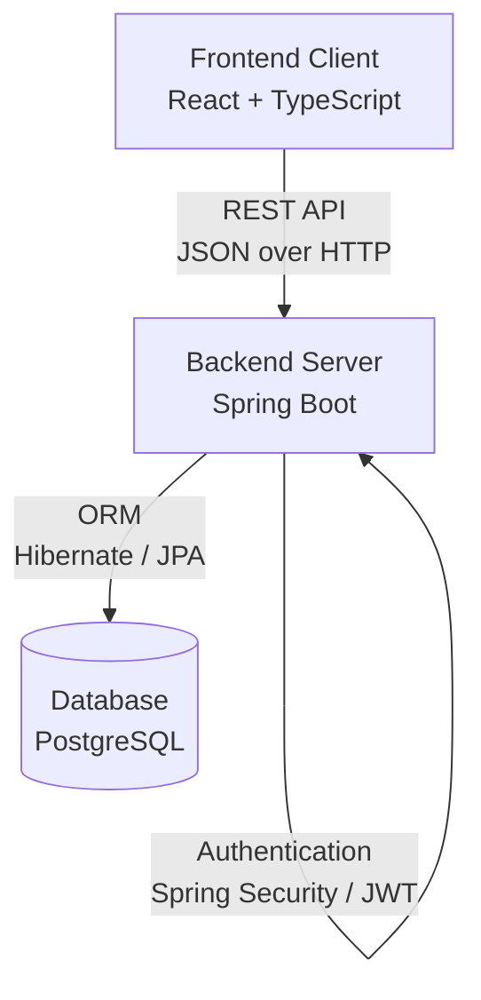

# RecruitTrack

RecruitTrack is a full-stack applicant tracking system (ATS) designed to streamline the end-to-end hiring process. Built for recruitment teams and hiring managers, the platform centralizes job requisition management, candidate tracking, interview scheduling, and pipeline analytics. By enforcing role-based access control and maintaining immutable audit trails, RecruitTrack provides a secure, single source of truth for hiring data.

---

## Resume Summary
* Architected a full-stack Applicant Tracking System (ATS) using React, TypeScript, and Spring Boot, centralizing job requisitions, candidate pipelines, and interview scheduling.
* Implemented a robust Role-Based Access Control (RBAC) system utilizing JWT authentication to securely scope data access for Admins, Recruiters, and Hiring Managers.
* Engineered an interactive, drag-and-drop Kanban pipeline leveraging React DND and RESTful APIs to persist candidate stage progression in real-time.
* Designed a normalized PostgreSQL database schema managed by JPA/Hibernate to efficiently query complex relationships across jobs, candidates, and multi-stage applications.
* Developed an analytics dashboard visualizing recruitment velocity, source attribution, and hiring funnels to drive data-informed recruitment decisions.

---

## Project Highlights
* **Role-based ATS platform** supporting Admins, Recruiters, and Hiring Managers.
* **90+ seeded candidates** with comprehensive dummy data for immediate testing.
* **Multi-stage hiring pipeline** with interactive drag-and-drop state persistence.
* **Interview scheduling** calendar with automated conflict resolution and duration tracking.
* **Analytics dashboard** featuring stage-by-stage hiring funnels and recruitment velocity metrics.
* **Audit logging** to maintain an immutable history of all system-level activities.
* **Resume management** with centralized candidate document handling.
* **JWT authentication** providing secure, stateless API access.
* **Spring Boot + React architecture** ensuring scalable and maintainable enterprise patterns.

---


## Features

### Authentication & Authorization
* **JWT Authentication:** Secure, stateless session management.
* **Role-Based Access Control:** Granular permissions across the platform.
* **Admin:** Full system access, capable of managing users, security policies, and system-wide configurations.
* **Recruiter:** Complete access to job postings, candidate pipelines, and interview scheduling.
* **Hiring Manager:** Restricted view tailored to assigned requisitions and candidate evaluations.

### Job Management
* **Create Jobs:** Structured job definitions with required skills, experience levels, and locations.
* **Manage Requisitions:** Track open headcount and assign departmental budgets.
* **Assign Hiring Managers:** Link specific roles to their respective decision-makers.
* **Track Open Roles:** Monitor active, draft, and closed positions.

### Candidate Management
* **Candidate Profiles:** Unified view of contact information, work history, and application status.
* **Resume Uploads:** Centralized document storage associated with candidate records.
* **Candidate Search:** Global search across names, emails, and phone numbers.
* **Candidate Filtering:** Faceted filtering by skills, experience, location, and application source.

### Application Pipeline
* **Multi-stage Hiring Workflow:** Customizable stages (e.g., Applied, Screening, Interview, Offer, Hired).
* **Drag-and-Drop Pipeline:** Interactive Kanban board for managing candidate progression.
* **Stage Tracking:** Timestamped records of when candidates enter and exit each phase.
* **Application History:** Historical tracking of a candidate's previous applications within the system.

### Interview Management
* **Interview Scheduling:** Coordinate panel, technical, and behavioral rounds.
* **Interview Tracking:** Centralized calendar view of upcoming and past interviews.
* **Feedback Collection:** Standardized scoring and qualitative review submissions from interviewers.

### Analytics & Reporting
* **Dashboard Metrics:** Real-time KPIs covering total applications, active jobs, and interviews.
* **Hiring Funnel:** Stage-by-stage drop-off analysis to identify pipeline bottlenecks.
* **Recruitment Velocity:** Average time-to-hire and time-in-stage metrics.
* **Candidate Source Analysis:** Breakdown of application origins (e.g., Referrals, Job Boards, Sourcing).

### Notifications
* **System Notifications:** In-app alerts for stage changes, new applications, and scheduled interviews.
* **Activity Tracking:** Unread indicator management and reference linking.

### Audit Logging
* **User Activity Tracking:** Immutable record of stage movements, feedback submissions, and role changes.
* **Administrative Visibility:** Searchable timeline of system events for compliance and security reviews.

---

## Technology Stack

**Frontend:**
* React
* TypeScript
* Vite
* React Query
* React Router
* Tailwind CSS

**Backend:**
* Spring Boot
* Spring Security
* JWT (JSON Web Tokens)
* JPA / Hibernate

**Database:**
* PostgreSQL

---

## Architecture Overview

The system utilizes a decoupled client-server architecture. The React single-page application communicates with a stateless Spring Boot REST API. Security is enforced at the API gateway layer via JWT verification, and data persistence is managed through JPA repositories interfacing with a PostgreSQL relational database.



### Architecture Decisions
* **Why React + TypeScript?** React's component-based architecture ensures UI consistency and modularity, particularly for complex interfaces like the Kanban pipeline. TypeScript was chosen to enforce strict type-safety across frontend data models, catching contract mismatches during compilation rather than runtime.
* **Why Spring Boot?** Spring Boot provides an enterprise-ready, opinionated framework that accelerates backend development. Its robust ecosystem (Spring Security, Spring Data JPA) handles boilerplate security and data access, allowing focus on core ATS business logic.
* **Why PostgreSQL?** The ATS data model requires strong ACID compliance and complex relational queries (e.g., aggregating candidates across multiple jobs and stages). PostgreSQL handles these concurrent, highly relational workloads efficiently.
* **Why JWT?** JSON Web Tokens allow for stateless, horizontally scalable authentication. By embedding user roles directly into the token payload, the API gateway can verify permissions without needing a secondary database lookup for every request.

### Key Engineering Challenges
* **Role-Based Access Control (RBAC):** Implementing contextual visibility where Hiring Managers only see candidates assigned to their specific requisitions, while Recruiters maintain global visibility, requiring dynamic query filtering at the JPA Specification level.
* **DTO Synchronization:** Maintaining strict data contracts between the React frontend and Spring Boot backend to prevent payload mismatches during complex entity updates.
* **Pipeline Persistence:** Ensuring that optimistic UI updates in the React Kanban board gracefully sync with the Spring Boot backend, rolling back state seamlessly if the API mutation fails.
* **Analytics Aggregation:** Designing efficient SQL/JPA queries to calculate stage-to-stage conversion rates (Hiring Funnel) and average time-to-hire without pulling full object graphs into application memory.
* **Search and Filtering:** Building a dynamic, multi-faceted filtering engine (by location, experience, department) that passes optional parameters from the React UI into dynamic `CriteriaBuilder` predicates in Hibernate.
* **Audit Logging:** Creating an immutable, system-wide event tracker that accurately records substantive mutations (like stage movements and role changes) across the platform without significantly degrading performance.
* **Resume Management:** Engineering a centralized candidate document handling system capable of securely processing, storing, and serving resume uploads via the REST API.

### What I Would Improve Next
While the current architecture successfully supports the core ATS workflows, the following areas represent realistic improvements for future iterations:
* **Email Integration:** Send automated candidate communications and interview invites via SMTP.
* **Cloud Storage:** Migrate candidate document storage (resumes, cover letters) from the local filesystem or database blobs to a distributed object store like Amazon S3 or Google Cloud Storage.
* **Search Indexing:** Introduce Elasticsearch or Typesense to handle fuzzy candidate searching and full-text resume querying, which relational `LIKE` queries cannot perform at scale.
* **Background Jobs:** Offload heavy processes like resume parsing, email notifications, and daily analytics roll-ups to a message broker (e.g., RabbitMQ or Kafka) and asynchronous workers.
* **Advanced Reporting:** Build exportable CSV reports and custom dashboard widget configurations to expand upon the existing analytics platform.

---

## Database Design

The data model is built around a set of highly relational entities:

* **Users:** System accounts containing authentication credentials and role definitions.
* **Jobs:** Requisitions representing open headcount, requirements, and metadata.
* **Candidates:** Individuals who have applied or been sourced for roles.
* **Applications:** The associative entity linking a Candidate to a specific Job, tracking their current stage.
* **Pipeline Stages:** Configurable steps in the hiring workflow mapped to Jobs.
* **Interviews:** Scheduled meetings linked to an Application, assigning specific Users as interviewers.
* **Feedback:** Evaluative records submitted by Users regarding a specific Interview.
* **Documents:** Uploaded files (resumes, cover letters) associated with Candidates.
* **Notifications:** Alerts generated for Users based on system events.
* **Audit Logs:** Immutable tracking records of substantive mutations across the platform.

---

## Demo Accounts

The application includes seeded accounts for demonstration purposes. 

* **Admin:** `admin@recruittrack.io`
* **Recruiter:** `recruiter@recruittrack.io`
* **Hiring Manager:** `manager@recruittrack.io`

**Password:** `Demo@123`

*Note: These credentials provide access to a local evaluation environment containing mocked organizational data.*

---

## Local Development Setup

### Prerequisites
* Java 21+
* Maven 3.8+
* Node.js 18+
* PostgreSQL 14+

### Backend Setup

1. **Database Creation:**
   Ensure PostgreSQL is running and create a blank database named `recruittrack` (or update `DATABASE_NAME` in your environment).

2. **Environment Configuration:**
   Configure the required environment variables (see below) in your terminal or IDE run configuration.

3. **Start the Application:**
   Navigate to the `backend` directory and start the Spring Boot server:
   ```bash
   cd backend
   mvn spring-boot:run
   ```

### Frontend Setup

1. **Install Dependencies:**
   Navigate to the root directory and install node modules:
   ```bash
   npm install
   ```

2. **Start the Development Server:**
   ```bash
   npm run dev
   ```
   The application will be available at `http://localhost:5173`.

---

## Environment Variables

To run the backend application, the following environment variables must be configured. 

| Variable | Description | Example |
|---|---|---|
| `DATABASE_HOST` | PostgreSQL server hostname | `localhost` |
| `DATABASE_PORT` | PostgreSQL server port | `5432` |
| `DATABASE_NAME` | PostgreSQL database name | `recruittrack` |
| `DATABASE_USERNAME` | PostgreSQL user | `postgres` |
| `DATABASE_PASSWORD` | PostgreSQL password | `postgres` |
| `JWT_SECRET=<base64_encoded_secret>` |
| `JWT_EXPIRATION_MS` | JWT validity duration in milliseconds | `86400000` |
| `CORS_ALLOWED_ORIGINS` | Permitted origins for cross-origin requests | `http://localhost:5173` |

*Do not commit actual production secrets to version control.*

---

## Demo Data

The backend includes a `DataSeeder` component that automatically populates the database upon initialization if no data exists. This idempotent process generates:

* Seeded admin, recruiter, and hiring manager users
* Active and drafted jobs across multiple departments
* Diverse candidate profiles with mock contact data
* Applications distributed across various pipeline stages
* Historical and upcoming interviews
* Feedback evaluations
* System notifications and audit logs

This ensures the application is immediately testable upon startup.

---

## Security

RecruitTrack implements standard security practices:

* **Password Hashing:** Passwords are never stored in plaintext; they are securely hashed utilizing BCrypt before persistence.
* **JWT Authentication:** The REST API requires a valid Bearer token for access, ensuring stateless, verifiable requests.
* **Role-Based Authorization:** Endpoints are protected via Spring Security `@PreAuthorize` annotations, restricting mutations (like DELETING candidates) to privileged roles.
* **Protected API Routes:** All business logic routes enforce authentication; only the authentication endpoints remain public.

---

## Future Improvements

* **Email Integration:** Send automated candidate communications and interview invites via SMTP.
* **Cloud Document Storage:** Migrate local resume storage to an S3-compatible object store.
* **Calendar Integration:** Sync scheduled interviews with Google Calendar or Microsoft Outlook.
* **Advanced Reporting:** Exportable CSV reports and custom dashboard widget configurations.
* **Automated Workflows:** Configurable triggers (e.g., automatically sending an assessment when a candidate moves to the "Screening" stage).

---

## Project Status

The application is feature-complete and suitable for demonstrations, portfolio presentation, and internal evaluation environments. The core pipeline, user management, and analytics features are fully operational.

---

## Author

**Nithish Saravanan**  
Software Engineer  
Passionate about building scalable, user-centric web applications and robust backend systems. 

